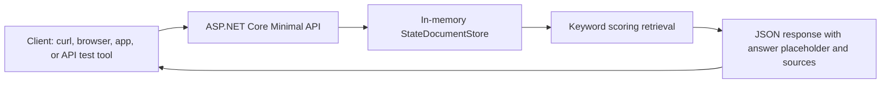
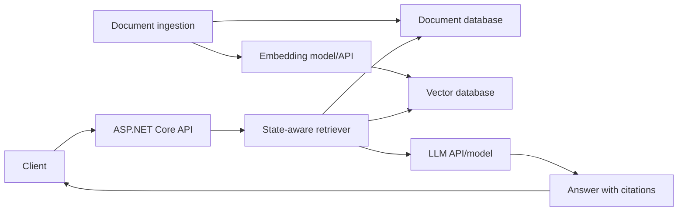

# Architecture

This project is a baseline API for state-aware retrieval augmented generation. The first version focuses on the retrieval shape before adding external infrastructure.

## Goals

- Keep the first run simple on macOS, Windows, and Linux.
- Make state/jurisdiction filtering a first-class concept.
- Return source records before answer generation.
- Leave clear extension points for embeddings, vector search, persistence, and LLM calls.

## Current Runtime Architecture



## Current Request Flow

1. A client sends a JSON request to `/query`.
2. The API validates that a question was provided.
3. The document store optionally filters documents by `state`.
4. The retrieval step scores documents using simple keyword matching.
5. The API returns a placeholder answer plus the matching source documents.

## Main Components

| Component | File | Responsibility |
| --- | --- | --- |
| Minimal API | `src/StateRagStarter.Api/Program.cs` | Defines HTTP endpoints |
| `StateDocumentStore` | `src/StateRagStarter.Api/Program.cs` | Stores and retrieves documents |
| `StateDocument` | `src/StateRagStarter.Api/Program.cs` | Represents source content |
| `QueryRequest` | `src/StateRagStarter.Api/Program.cs` | Represents a user question |
| `QueryResponse` | `src/StateRagStarter.Api/Program.cs` | Returns an answer placeholder and sources |

## Data Model

```text
StateDocument
├── Id
├── State
├── Title
├── Content
├── Tags
└── UpdatedAt
```

The `State` field is central to the project. It allows the retrieval layer to narrow context before answer generation, which is important for legal, policy, benefits, compliance, and other jurisdiction-sensitive domains.

## Planned RAG Architecture



## Suggested Extension Points

### Persistence

Replace `StateDocumentStore` with a repository backed by SQLite, PostgreSQL, or another database.

### Embeddings

Add an embeddings service that converts document chunks and user questions into vectors.

### Vector Search

Replace keyword scoring with vector similarity search. Keep the state filter as part of the retrieval query.

### LLM Answer Generation

Add a service that receives the user question and retrieved source documents, calls an LLM, and returns an answer with citations.

### API Documentation

Add OpenAPI/Swagger once external packages are acceptable for the project baseline.

## Current Limitations

- Data is not persisted after the process stops.
- Retrieval is keyword-based, not semantic.
- No LLM, model, or AI API is configured yet.
- No authentication or authorization is included.
- No tests are included yet.
